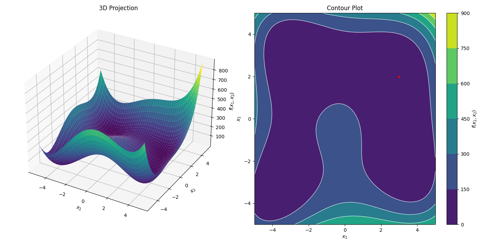
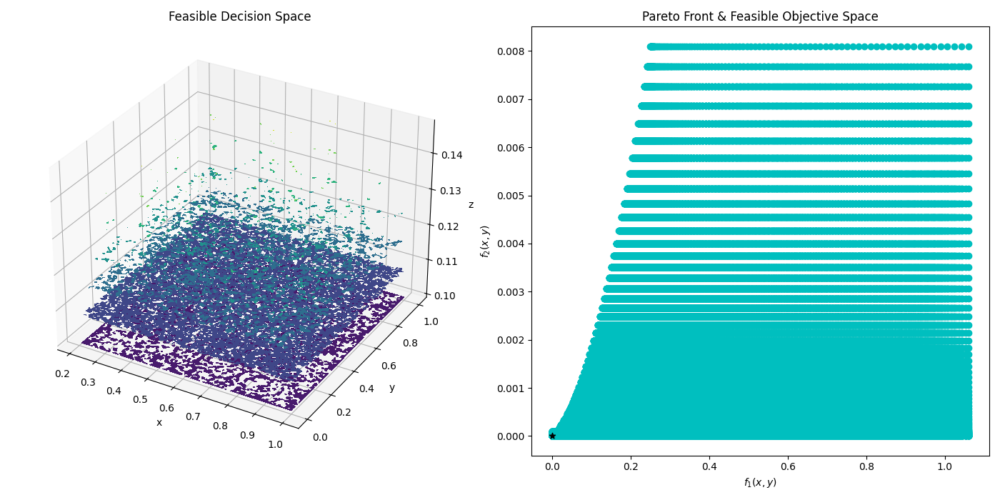

# genetic_python

Class-based genetic algorithm written in Python, structured for the AntennaCAT optimizer suite.

The original repository was called: [Example Genetic-Algorithm Drawing](https://github.com/LC-Linkous/Example_Genetic-Algorithm-Drawing). genetic_python has been restructured from the original organism/population drawing example into the state-machine optimizer format used across the AntennaCAT optimizer suite collection, so it is interchangeable with the other optimizers behind a common driver loop.

## Table of Contents
* [Genetic Algorithm](#genetic-algorithm)
* [Requirements](#requirements)
* [Implementation](#implementation)
    * [Initialization](#initialization)
    * [State Machine-based Structure](#state-machine-based-structure)
    * [Importing and Exporting Optimizer State](#importing-and-exporting-optimizer-state)
    * [Gene Representation and Length Modes](#gene-representation-and-length-modes)
    * [Genetic Operators](#genetic-operators)
    * [Constraint Handling](#constraint-handling)
    * [Multi-Objective Optimization](#multi-objective-optimization)
    * [Objective Function Handling](#objective-function-handling)
      * [Creating a Custom Objective Function](#creating-a-custom-objective-function)
      * [Internal Objective Function Example](#internal-objective-function-example)
      * [Target vs. Threshold Configuration](#target-vs-threshold-configuration)
* [Example Implementations](#example-implementations)
    * [Basic GA Example](#basic-ga-example)
    * [Realtime Graph](#realtime-graph)
* [References](#references)
* [Related Publications and Repositories](#related-publications-and-repositories)
* [Licensing](#licensing)

## Genetic Algorithm

Genetic Algorithms (GAs) are a class of nature-inspired optimization algorithms based on the principles of natural selection and genetics, introduced in "Adaptation in Natural and Artificial Systems" [1] (J. Holland, 1975). They are used to find approximate solutions to complex optimization problems by evolving a population of candidate solutions over successive generations.

A GA maintains a population of individuals, each encoding a candidate solution as a set of genes (the chromosome). Each generation, individuals are selected based on fitness, recombined through crossover, and altered through mutation to produce offspring. Over many generations the population is driven toward better solutions, balancing exploration of the search space against exploitation of known-good regions.

This implementation supports both fixed-length problems (a constant set of numerical parameters to tune) and variable-length problems (where the number of genes itself evolves, as in the original image-drawing example). See [Gene Representation and Length Modes](#gene-representation-and-length-modes).

## Requirements

This project requires numpy, pandas, and matplotlib for the full demos. To run the optimizer without visualization, only numpy and pandas are requirements. The included image objective additionally uses Pillow.

Use 'pip install -r requirements.txt' to install the following dependencies:

```python
contourpy==1.3.3
cycler==0.12.1
fonttools==4.63.0
kiwisolver==1.5.0
matplotlib==3.10.9
numpy==2.4.6
packaging==26.2
pandas==3.0.3
pillow==12.2.0
pyparsing==3.3.2
python-dateutil==2.9.0.post0
six==1.17.0
tzdata==2026.2
```

Optionally, requirements can be installed manually with:

```python
pip install matplotlib, numpy, pandas

```
This is an example for if you've had a difficult time with the requirements.txt file. Sometimes libraries are packaged together.

NOTE: this optimizer has been updated for NumPy 2.x compatibility. Scalar extraction from array cells uses explicit `.item()` calls, as NumPy 2 no longer implicitly converts single-element arrays to Python scalars.

## Implementation

### Initialization

```python
        # Constant variables
        POPULATION_SIZE = 30         # Number of individuals in the population
        TOL = 10 ** -6               # Convergence Tolerance
        MAXIT = 5000                 # Maximum allowed iterations
        MUTATE_ATTEMPTS = 1          # mutate-and-pick retries per offspring

        # Objective function dependent variables
        func_F = func_configs.OBJECTIVE_FUNC  # objective function
        constr_F = func_configs.CONSTR_FUNC   # constraint function

        LB = func_configs.LB              # Lower boundaries (per-gene feature bounds)
        UB = func_configs.UB              # Upper boundaries (per-gene feature bounds)
        OUT_VARS = func_configs.OUT_VARS  # Number of output variables (y-values)
        TARGETS = func_configs.TARGETS    # Target values for output
        NUM_FEATURES = func_configs.IN_VARS  # values per gene

        # Gene configuration.
        # Fixed-length (numerical parameter tuning): one gene = all IN_VARS variables.
        NUM_GENES = 1                # active genes an individual starts with
        MAX_GENES = 1                # hard ceiling (sets fixed decision-vector width)
        VARIABLE_LENGTH = False      # True allows gene spawn/remove (evolving complexity)

        best_eval = float('inf')
        parent = None                # for passing debug back to the parent class
        evaluate_threshold = False   # use target or threshold. True = THRESHOLD, False = EXACT TARGET
        suppress_output = True       # Suppress the console output of the optimizer
        allow_update = True          # Allow objective call to update state


        # Constant variables in a list format
        opt_params = {'POPULATION_SIZE': [POPULATION_SIZE], # Number of individuals
                    'NUM_GENES': [NUM_GENES],               # starting active genes
                    'MAX_GENES': [MAX_GENES],               # fixed decision-vector width
                    'NUM_FEATURES': [NUM_FEATURES],         # values per gene
                    'MUTATION_RATE': [0.03],                # per-feature mutation driver
                    'SCALE_FACTOR': [0.25],                 # mutation/blend std-dev tuning
                    'SPAWN_CHANCE': [0.20],                 # chance a mutation adds/removes a gene
                    'REMOVE_CHANCE': [0.03],                # chance a spawn event is a removal
                    'MUTATE_ATTEMPTS': [MUTATE_ATTEMPTS],   # mutate-and-pick retries
                    'CROSS_RATE': [0.7],                    # prob a shared gene comes from parent A
                    'VARIABLE_LENGTH': [VARIABLE_LENGTH] }  # fixed vs variable gene count
        # dataframe conversion
        opt_df = pd.DataFrame(opt_params)

        # optimizer initialization
        myOptimizer = genetic_algorithm(LB, UB, TARGETS, TOL, MAXIT,
                                func_F, constr_F,
                                opt_df,
                                parent=parent,
                                evaluate_threshold=False, obj_threshold=None,
                                decimal_limit=4)

    # arguments should take form:
    # genetic_algorithm([[float, float, ...]], [[float, float, ...]], [[float, ...]], float, int,
    # func, func,
    # dataFrame,
    # class obj,
    # bool, [int, int, ...],
    # int)
    #
    # opt_df contains class-specific tuning parameters
    # POPULATION_SIZE: int
    # NUM_GENES: int
    # MAX_GENES: int
    # NUM_FEATURES: int
    # MUTATION_RATE: float
    # SCALE_FACTOR: float
    # SPAWN_CHANCE: float
    # REMOVE_CHANCE: float
    # MUTATE_ATTEMPTS: int
    # CROSS_RATE: float
    # VARIABLE_LENGTH: bool

```

### State Machine-based Structure

This optimizer uses a state machine structure to control the evolution of the population, the call to the objective function, and the evaluation of current positions. The state machine implementation preserves the original genetic algorithm while making it possible to integrate other programs, classes, or functions as the objective function.

A controller with a `while loop` to check the completion status of the optimizer drives the process. Completion status is determined by at least 1) a set MAX number of iterations, and 2) the convergence to a given target using the L2 norm. Iterations are counted by calls to the objective function.

A key property of this structure, shared with the other optimizers in the suite, is that **one individual is evaluated per step**. A full generation is bred only when the individual counter wraps back to the start of the population: at that point selection, crossover, and mutation produce the entire next generation into a staging buffer, and the individuals are then doled out one objective evaluation at a time. This keeps each `call_objective` equal to exactly one evaluation, which matters when the objective is expensive (for example, a simulation that must run and have its output parsed before the next individual proceeds), and allows mid-run checkpointing between individuals.

Within this `while loop` are three function calls to control the optimizer class:
* **complete**: the `complete function` checks the status of the optimizer and if it has met the convergence or stop conditions.
* **step**: the `step function` takes a boolean variable (suppress_output) as an input to control detailed printout on the current individual (or agent) status. This function moves the optimizer one step forward.
* **call_objective**: the `call_objective function` takes a boolean variable (allow_update) to control if the objective function is able to be called. In most implementations, this value will always be true. However, there may be cases where the controller or a program running the state machine needs to assert control over this function without stopping the loop.

Additionally, **get_convergence_data** can be used to preview the current status of the optimizer, including the current best evaluation and the iterations.

The code below is an example of this process:

```python
    while not myOptimizer.complete():
        # step through optimizer processing
        # this will update individual or agent locations
        myOptimizer.step(suppress_output)
        # call the objective function, control
        # when it is allowed to update and return
        # control to optimizer
        myOptimizer.call_objective(allow_update)
        # check the current progress of the optimizer
        # iter: the number of objective function calls
        # eval: current 'best' evaluation of the optimizer
        iter, eval = myOptimizer.get_convergence_data()
        if (eval < best_eval) and (eval != 0):
            best_eval = eval

        # optional. if the optimizer is not printing out detailed
        # reports, preview by checking the iteration and best evaluation

        if suppress_output:
            if iter%100 ==0: #print out every 100th iteration update
                print("Iteration")
                print(iter)
                print("Best Eval")
                print(best_eval)
```

### Importing and Exporting Optimizer State

Some optimizer information can be exported or imported. This varies based on each optimizer.

Optimizer state can be exported at any step. When importing an optimizer state, the optimizer should be initialized first, and then the state information can be imported via a Python pickle file. Other methods can be used if custom code is written to handle preprocessing.

Because one individual is evaluated per step, exported state can be used to checkpoint mid-generation; a resumed optimizer continues from the exact individual it left off on. The fixed/variable length mode is part of the exported state, so a checkpointed fixed-length run resumes as fixed-length.

Returning data from optimizer and saving to a .pkl file:
```python
    data = demo_optimizer.export_swarm()
    data_df = pd.DataFrame(data)
    print(data_df)
    data_df.to_pickle('output_data_df.pkl')

```


Importing data from a .pkl file and importing it into the optimizer:
```python
    data_df = pd.read_pickle('output_data_df.pkl')
    demo_optimizer.import_swarm(data_df)

```

### Gene Representation and Length Modes

An individual encodes its candidate solution as a chromosome: a set of genes, where each gene holds `NUM_FEATURES` values. Internally the chromosome is stored as a fixed-width decision vector (`MAX_GENES` x `NUM_FEATURES`, flattened) together with a per-gene active mask. This keeps the decision vector at a strict, constant dimensionality so the state arrays round-trip cleanly through export and import, while still allowing the effective number of genes to change.

Two length modes are controlled by the `VARIABLE_LENGTH` flag in `opt_df`:

* **Fixed length** (`VARIABLE_LENGTH = False`): every individual has exactly `NUM_GENES` active genes and gene spawn/remove is disabled. `MAX_GENES` is forced to `NUM_GENES`. This is the correct mode for tuning a fixed set of numerical parameters, and is the natural fit for the equation objective functions. For these problems, one gene holding all `IN_VARS` variables (`NUM_GENES = 1`, `NUM_FEATURES = IN_VARS`) is the typical configuration.

* **Variable length** (`VARIABLE_LENGTH = True`): genes may be added or removed during mutation, so the complexity of an individual evolves over the run. The active gene count is bounded above by `MAX_GENES`. This is the mode for problems like the image-drawing objective, where the number of shapes is itself part of what is being optimized.

If `VARIABLE_LENGTH` is omitted from `opt_df`, it defaults to `True` for backward compatibility with the original variable-length behavior.

### Genetic Operators

* **Selection**: parents are chosen with rank-based weighting, favoring individuals with lower error (smaller L2 norm of the objective output). Each surviving individual's best result is retained between generations.
* **Crossover**: for each gene index shared by two parents, the child takes the gene from parent A with probability `CROSS_RATE`, otherwise from parent B. Genes held by only one parent are handled according to which parent carries them. In fixed-length mode this produces a same-width child; in variable-length mode child length can vary.
* **Mutation**: with probability driven by `MUTATION_RATE` and `SCALE_FACTOR`, gene feature values are perturbed by Gaussian steps whose size decays as an individual grows, keeping later mutations less disruptive. In variable-length mode, a mutation event may instead add a gene (by blending two existing genes) or remove one, governed by `SPAWN_CHANCE` and `REMOVE_CHANCE`. In fixed-length mode the spawn/remove branch is disabled.

### Constraint Handling
Users must create their own constraint function for their problems, if there are constraints beyond the problem bounds. This is then passed into the constructor. If the default constraint function is used, it always returns true (which means there are no constraints). An individual whose objective evaluation reports an error (for example, a failed simulation or an invalid output) is assigned a large sentinel fitness so that it cannot win selection, allowing a flaky evaluation to degrade gracefully rather than halt the optimization.

### Multi-Objective Optimization
The no preference method of multi-objective optimization, but a Pareto Front is not calculated. Instead, the best choice (smallest norm of output vectors) is listed as the output.

### Objective Function Handling

The objective function is handled in two parts.


* First, a defined function, such as one passed in from `func_F.py` (see examples), is evaluated based on the current individual's active genes. This allows for the optimizers to be utilized in the context of 1. benchmark functions from the objective function library, 2. user defined functions, 3. replacing explicitly defined functions with outside calls to programs such as simulations or other scripts that return a matrix of evaluated outputs. The optimizer passes only the active genes of the current individual to the objective; rendering, simulation, or any other domain logic lives entirely inside the objective function and never inside the optimizer.

* Secondly, the actual objective function is evaluated. In the AntennaCAT set of optimizers, the objective function evaluation is either a `TARGET` or `THRESHOLD` evaluation. For a `TARGET` evaluation, which is the default behavior, the optimizer minimizes the absolute value of the difference of the target outputs and the evaluated outputs. A `THRESHOLD` evaluation includes boolean logic to determine if a 'greater than or equal to' or 'less than or equal to' or 'equal to' relation between the target outputs (or thresholds) and the evaluated outputs exist.

Future versions may include options for function minimization when target values are absent.


#### Creating a Custom Objective Function

Custom objective functions can be used by creating a directory with the following files:
* configs_F.py
* constr_F.py
* func_F.py

`configs_F.py` contains lower bounds, upper bounds, the number of input variables, the number of output variables, the target values, and a global minimum if known. This file is used primarily for unit testing and evaluation of accuracy. If these values are not known, or are dynamic, then they can be included experimentally in the controller that runs the optimizer's state machine. For the genetic algorithm, the bounds describe one gene's feature ranges (length `IN_VARS`); the optimizer tiles these across `MAX_GENES` to build the full decision vector.

`constr_F.py` contains a function called `constr_F` that takes in an array, `X`, of individual positions to determine if the individual or agent is in a valid or invalid location.

`func_F.py` contains the objective function, `func_F`, which takes two inputs. The first input, `X`, is the array of individual or agent positions (the active genes, flattened). The second input, `NO_OF_OUTS`, is the integer number of output variables, which is used to set the array size. In included objective functions, the default value is hardcoded to work with the specific objective function.

Below are examples of the format for these files.

`configs_F.py`:
```python
OBJECTIVE_FUNC = func_F
CONSTR_FUNC = constr_F
OBJECTIVE_FUNC_NAME = "one_dim_x_test.func_F" #format: FUNCTION NAME.FUNCTION
CONSTR_FUNC_NAME = "one_dim_x_test.constr_F" #format: FUNCTION NAME.FUNCTION

# problem dependent variables
LB = [[0]]             # Lower boundaries
UB = [[1]]             # Upper boundaries
IN_VARS = 1            # Number of input variables (x-values)
OUT_VARS = 1           # Number of output variables (y-values)
TARGETS = [0]          # Target values for output
GLOBAL_MIN = []        # Global minima sample, if they exist.

```

`constr_F.py`, with no constraints:
```python
def constr_F(x):
    F = True
    return F
```

`constr_F.py`, with constraints:
```python
def constr_F(X):
    F = True
    # objective function/problem constraints
    if (X[2] > X[0]/2) or (X[2] < 0.1):
        F = False
    return F
```

`func_F.py`:
```python
import numpy as np
import time

def func_F(X, NO_OF_OUTS=1):
    F = np.zeros((NO_OF_OUTS))
    noErrors = True
    try:
        x = X[0]
        F = np.sin(5 * x**3) + np.cos(5 * x) * (1 - np.tanh(x ** 2))
    except Exception as e:
        print(e)
        noErrors = False

    return [F], noErrors
```

#### Internal Objective Function Example

There are four objective functions included in the repository:
1) Himmelblau's function, which takes 2 inputs and has 1 output
2) A multi-objective function with 3 inputs and 2 outputs (see lundquist_3_var)
3) A single-objective function with 1 input and 1 output (see one_dim_x_test)
4) An image-matching objective, which evolves a set of shapes to approximate a reference image (see obj_func_img). This is the variable-length example.

The first three are fixed-length numerical problems and run with `VARIABLE_LENGTH = False`. The image objective is the variable-length example and runs with `VARIABLE_LENGTH = True`.

Each numerical function has four files in a directory:
   1) configs_F.py - contains imports for the objective function and constraints, CONSTANT assignments for functions and labeling, boundary ranges, the number of input variables, the number of output values, and the target values for the output
   2) constr_F.py - contains a function with the problem constraints, both for the function and for error handling in the case of under/overflow.
   3) func_F.py - contains a function with the objective function.
   4) graph.py - contains a script to graph the function for visualization.

The image objective (obj_func_img) follows the same `configs_F.py` / `constr_F.py` / `func_F.py` format, and adds a `shape_decoder.py` helper that converts a flat array of genes into drawable shapes. The same decoder is used both by the objective (which renders headless and compares to the reference) and by the realtime graph driver, so the scored image and the displayed image cannot drift. Reference images live in an `images/` subdirectory; the driver selects which one to use.

Other objective functions can be applied to this project by following the same format.

<p align="center">
        
</p>
   <p align="center">Plotted Himmelblau’s Function with 3D Plot on the Left, and a 2D Contour on the Right</p>

```math
f(x, y) = (x^2 + y - 11)^2 + (x + y^2 - 7)^2
```

| Global Minima | Boundary | Constraints |
|----------|----------|----------|
| f(3, 2) = 0                 | $-5 \leq x,y \leq 5$  |   |
| f(-2.805118, 3.121212) = 0  | $-5 \leq x,y \leq 5$  |   |
| f(-3.779310, -3.283186) = 0 | $-5 \leq x,y \leq 5$  |   |
| f(3.584428, -1.848126) = 0  | $-5 \leq x,y \leq 5$   |   |

<p align="center">
        
</p>
   <p align="center">Plotted Multi-Objective Function Feasible Decision Space and Objective Space with Pareto Front</p>

```math
\text{minimize}:
\begin{cases}
f_{1}(\mathbf{x}) = (x_1-0.5)^2 + (x_2-0.1)^2 \\
f_{2}(\mathbf{x}) = (x_3-0.2)^4
\end{cases}
```

| Num. Input Variables| Boundary | Constraints |
|----------|----------|----------|
| 3      | $0.21\leq x_1\leq 1$ <br> $0\leq x_2\leq 1$ <br> $0.1 \leq x_3\leq 0.5$  | $x_3\gt \frac{x_1}{2}$ or $x_3\lt 0.1$|

<p align="center">
        
</p>
   <p align="center">Plotted Single Input, Single-objective Function Feasible Decision Space and Objective Space with Pareto Front</p>

```math
f(\mathbf{x}) = sin(5 * x^3) + cos(5 * x) * (1 - tanh(x^2))
```
| Num. Input Variables| Boundary | Constraints |
|----------|----------|----------|
| 1      | $0\leq x\leq 1$  | $0\leq x\leq 1$| |

Local minima at $(0.444453, -0.0630916)$

Global minima at $(0.974857, -0.954872)$

### Target vs. Threshold Configuration

The user can toggle TARGET and THRESHOLD evaluation for the optimized values. The key variables for this are:

```python
# Boolean. use target or threshold. True = THRESHOLD, False = EXACT TARGET
evaluate_threshold = True

# array
TARGETS = func_configs.TARGETS    # Target values for output from function configs
# OR:
TARGETS = [0,0,0] #manually set BASED ON PROBLEM DIMENSIONS

# threshold is same dims as TARGETS
# 0 = use target value as actual target. value should EQUAL target
# 1 = use as threshold. value should be LESS THAN OR EQUAL to target
# 2 = use as threshold. value should be GREATER THAN OR EQUAL to target
#DEFAULT THRESHOLD
THRESHOLD = np.zeros_like(TARGETS)
# OR
THRESHOLD = [0,1,2] # can be any mix of TARGET and THRESHOLD
```

To implement this, the original fitness calculation has been replaced with the function `objective_function_evaluation`, which returns a numpy array.

The original calculation:
```python
self.Flist = abs(self.targets - self.Fvals)
```
Where `self.Fvals` is a re-arranged and error checked returned value from the passed in function from `func_F.py` (see examples for the internal objective function or creating a custom objective function).

When using a THRESHOLD, the `Flist` value corresponding to the target is set to epsilon (the smallest system value) if the evaluated `func_F` value meets the threshold condition for that target item. If the threshold is not met, the absolute value of the difference of the target output and the evaluated output is used. With a THRESHOLD configuration, each value in the numpy array is evaluated individually, so some values can be 'greater than or equal to' the target while others are 'equal' or 'less than or equal to' the target.

NOTE: the original genetic algorithm maximized fitness (less negative is better). In the suite format the optimizer minimizes the L2 norm of the objective output toward the target, so objective functions return an error to be minimized (target 0). The included image objective reflects this: it returns mean absolute pixel difference plus a small gene-count penalty, with the sign flipped relative to the original drawing example.

## Example Implementations

### Basic GA Example
`main_test.py` provides a sample use case of the optimizer. The objective function is selected at the top of the file; equation objectives run fixed-length and the image objective runs variable-length, handled automatically by the driver.

### Realtime Graph

`main_test_graph.py` provides an example with a realtime graph. For the image objective it shows the reference image alongside the current best evolved image, updating as the optimization runs. All rendering lives in the driver (not the optimizer), using the same shape decoder the objective uses.

NOTE: if you close the graph as the code is running, the code will continue to run, but the graph will not re-open.

## References

[1] J. H. Holland, "Adaptation in Natural and Artificial Systems," University of Michigan Press, Ann Arbor, 1975.

The original drawing example this project was restructured from is based on the genetic algorithm tutorials by Samuel Hinton:
* https://cosmiccoding.com.au/tutorials/genetic_part_one
* https://cosmiccoding.com.au/tutorials/genetic_part_two

## Related Publications and Repositories
This software works as a stand-alone implementation, and as one of the optimizers integrated into AntennaCAT.

## Licensing

The code in this repository has been released under GPL-2.0